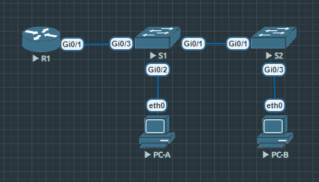
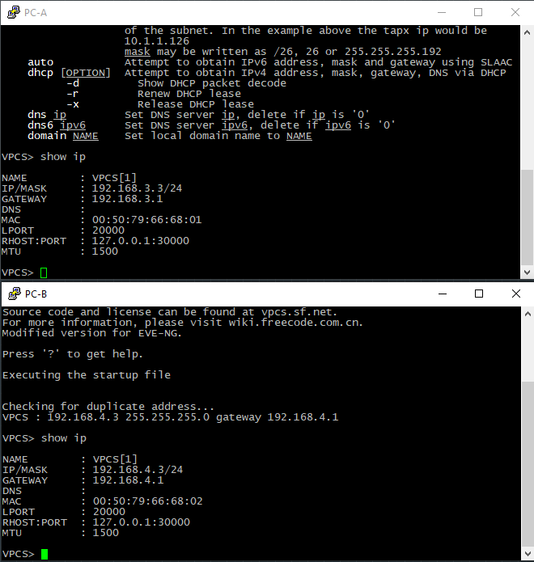

# Lab 1
## Топология
```Info
Порты для VLAN'ов были изменены:
VLAN 3 - Gi0/2
VLAN 4 - Gi0/3
VLAN 7 - Gi0/0 Gi0/2 Gi1/0 Gi1/1 Gi1/2 Gi1/3
```

## Настройка маршрутизатора
### Отключение поиска DNS

### Назначение и шифрование паролей, установка баннера
#### Установка баннера и пароля для виртуального терминала

#### Назначение имени устройства, пароля для привилегированного режима и шифрование паролей

### Настройка времени

## Настройка коммутатора
### Отключение поиска DNS

### Назначение имени устройства, установка паролей и их шифрование


### Настройка времени

## Настройка ПК

## Создание и настройка VLAN на коммутаторах
### Создание VLAN'ов
#### Первый коммутатор

#### Второй коммутатор

### Настройка интерфейса управления и шлюза на коммутаторах
#### Первый коммутатор

#### Второй коммутатор

### Назначение неиспользуемых портов на VLAN ParkingLot с последующей деактивацией их
#### Первый коммутатор
##### Назначение неиспользуемых портов

##### Отключение портов

#### Второй коммутатор
##### Назначение неиспользуемых портов

##### Отключение портов

### Назначение используемых портов соответствующему VLAN
#### Первый коммутатор


#### Второй коммутатор


### Настройка магистрального канала
#### Первый коммутатор

#### Второй коммутатор

### Проверка транкинга
При отключении интерфейса на R1, PC-A и PC-B не видят друг друга

### Настройка маршрутизации

### Проверка маршрутизации между VLAN
#### Эхо-запрос с PC-A на шлюз по умолчанию

#### Эхо-запрос с PC-A на PC-B

#### Эхо-запрос с PC-A на коммутатор S2

#### Выполнение команды tracer с PC-B на адрес PC-A
