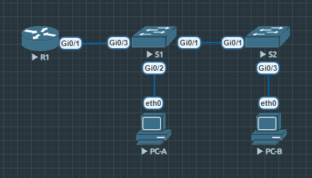

# otus_entirely
### Топология

### Отключение поиска DNS и установка имени устройства

### Назначение и шифрование паролей, установка баннера
#### Установка баннера и пароля для виртуального терминала

#### Установка пароля для привилегированного режима и шифрование паролей

### Настройка времени
